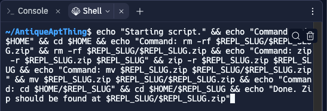

# repl-zip
Simple bash script to download repl.it tasks.

As of now, The zip function does not currently work for classes within an organisation. Therefore, I wrote this simple bash script to speed things up.

[Source](/command.sh)

# Usage

To use this script copy the [Raw source](https://raw.githubusercontent.com/matthew-mw/repl-zip/main/command.sh), visit the search bar on replit and open the shell.


Paste the script and execute it.



It might ask you to install the zip package.
```console
Would you like to run zip from Nix and add it to your replit.nix file?
```
If this shows up, enter Y

You should find your zip in the workspace!


To download the zip, hover over the file, click on the three dots


Click the download button after clicking on the three dots


You should be done. Congrats!

Below is an example of the script when executed.
```console
~/AntiqueAptThing$ echo "Starting script." && echo "Command: cd $HOME" && cd $HOME && echo "Command: rm -rf $REPL_SLUG/$REPL_SLUG.zip" && rm -rf $REPL_SLUG/$REPL_SLUG.zip && echo "Command: zip -r $REPL_SLUG.zip $REPL_SLUG" && zip -r $REPL_SLUG.zip $REPL_SLUG && echo "Command: mv $REPL_SLUG.zip $REPL_SLUG/$REPL_SLUG.zip" && mv $REPL_SLUG.zip $REPL_SLUG/$REPL_SLUG.zip && echo "Command: cd $HOME/$REPL_SLUG" && cd $HOME/$REPL_SLUG && echo "Done. Zip should be found at $REPL_SLUG/$REPL_SLUG.zip"
Starting script.
Command: cd /home/runner
Command: rm -rf AntiqueAptThing/AntiqueAptThing.zip
Command: zip -r AntiqueAptThing.zip AntiqueAptThing
zip: command not installed, but was located via Nix.
Would you like to run zip from Nix and add it to your replit.nix file? [Yn]: Y
Adding zip to replit.nix
success
/nix/store/ajz75fg6mkhv15s7p95ii2vcmyhdccnp-zip-3.0
  adding: AntiqueAptThing/ (stored 0%)
  adding: AntiqueAptThing/.cache/ (stored 0%)
  adding: AntiqueAptThing/.cache/replit/ (stored 0%)
  adding: AntiqueAptThing/.cache/replit/nix/ (stored 0%)
  adding: AntiqueAptThing/.cache/replit/nix/env.json (deflated 63%)
  adding: AntiqueAptThing/.cache/replit/modules/ (stored 0%)
  adding: AntiqueAptThing/.cache/replit/modules/python-3.10:v23-20230918-15fb6e7 (deflated 56%)
  adding: AntiqueAptThing/.cache/replit/modules/python-3.10:v23-20230918-15fb6e7.res (deflated 47%)
  adding: AntiqueAptThing/.cache/replit/modules.stamp (stored 0%)
  adding: AntiqueAptThing/.cache/replit/__replit_disk_meta.json (deflated 7%)
  adding: AntiqueAptThing/replit.nix (deflated 5%)
  adding: AntiqueAptThing/main.py (stored 0%)
  adding: AntiqueAptThing/.replit (deflated 27%)
  adding: AntiqueAptThing/pyproject.toml (deflated 36%)
  adding: AntiqueAptThing/poetry.lock (deflated 75%)
  adding: AntiqueAptThing/.upm/ (stored 0%)
  adding: AntiqueAptThing/.upm/store.json (deflated 7%)
Command: mv AntiqueAptThing.zip AntiqueAptThing/AntiqueAptThing.zip
Command: cd /home/runner/AntiqueAptThing
Done. Zip should be found at AntiqueAptThing/AntiqueAptThing.zip
Detected change in environment, reloading shell...
~/AntiqueAptThing$ 
```
